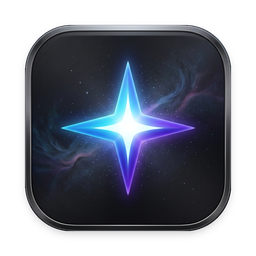

<div align="center">



# Lumo

**A native macOS notch companion for Google Antigravity CLI (`agy`) & Gemini models.**

Approve tool permissions, watch your agents work step-by-step, review code edits, and chat with Gemini 2.5 Flash / Pro — straight from your MacBook's notch.


</div>

---

## About & Heritage

**Lumo** is a focused fork and evolution of **[Coucou](https://github.com/Louis-CFM/coucou)** created by **[@Louis-CFM](https://github.com/Louis-CFM)**. 

While Coucou was crafted for Anthropic's Claude Code CLI, **Lumo** is tailored specifically for the **Google Antigravity** terminal agent (`agy`) and **Gemini models** (Gemini 2.5 Flash & Pro via Google One AI Premium / Ultra or Google AI Studio).

### Key Adaptations in Lumo
- **Native macOS & Apple Silicon Only:** Windows components, Named Pipes, and Tauri code have been completely excised in favor of ultra-smooth, lightweight native Swift & SwiftUI `NSPanel`.
- **Google Antigravity Lifecycle Hook Engine:** Auto-injects and synchronizes with `~/.gemini/config/hooks.json` via a fail-safe Python bridge (`lumo_bridge.py`).
- **Antigravity Action Normalization:** Direct recognition of Antigravity tools: `run_command`, `write_to_file`, `replace_file_content`, `view_file`, `grep_search`, `browser_subagent`, and `ask_question`.
- **One-Click Notch Permissions:** Instant **Allow (Y)** / **Deny (N)** for CLI tool executions without switching focus from your editor.
- **Built-in Gemini Chat:** Direct interactive chat powered by Google Gemini 2.5 streaming API with Keychain-secured credentials.

---

## Features

- ⚡️ **Antigravity CLI, Live** — Watch your agent run commands, edit files, search codebases, and browse pages live from your notch.
- 🛡️ **Zero-Friction Approvals** — Approve sensitive terminal commands and tool executions directly from the notch.
- ❓ **Interactive Question Dialogs** — Answer `ask_question` prompts with multi-choice options without losing terminal context.
- 💬 **Gemini 2.5 Notch Chat** — Ask questions, review code snippets, or prompt Gemini anytime.
- 📎 **Drag & Drop Context** — Drop files onto Lumo to feed them into your agent sessions.
- 🫥 **Invisible When Idle** — Slides seamlessly behind your MacBook notch when no agents are running, waking with a playful spring when active.
- 🔒 **Private & Local** — Zero telemetry. Communication happens over a local Unix domain socket (`~/.lumo/lumo.sock`). Keys stay in your macOS Keychain.

---

## Architecture & Data Flow

```
┌──────────────────────────────────────────────────────────┐
│                 MacBook Notch Overlay                    │
│      Lumo.app (Swift / SwiftUI borderless NSPanel)       │
│                  - Floating at .mainMenu + 3             │
│                  - Event pass-through for transparent bg │
└────────────────────────────▲─────────────────────────────┘
                             │
                  UNIX Domain Socket
                  `~/.lumo/lumo.sock`
                             │
┌────────────────────────────▼─────────────────────────────┐
│             lumo_bridge.py (Fail-Safe Bridge)            │
│       - Auto-configured in ~/.gemini/config/hooks.json    │
│       - Exits in <5ms with default allow if Lumo is off  │
│       - 2-way approval handshake for PreToolUse          │
└────────────────────────────▲─────────────────────────────┘
                             │
┌────────────────────────────┴─────────────────────────────┐
│          Google Antigravity CLI (`agy`) Execution Loop    │
└──────────────────────────────────────────────────────────┘
```

---

## Installation & Quick Start

### 1. Build and Run
Clone the repository and build via Xcode or command line:

```bash
cd NotchBuddy
xcodegen generate
xcodebuild -project Lumo.xcodeproj -scheme Lumo -configuration Release build
```

Then run `Lumo.app`.

### 2. Zero-Config Antigravity Setup
When `Lumo.app` starts for the first time:
1. It initializes the local Unix domain socket at `~/.lumo/lumo.sock`.
2. It verifies/installs the bridge script `~/.lumo/lumo_bridge.py`.
3. It registers the lifecycle hooks inside `~/.gemini/config/hooks.json`.

Now whenever you run `agy` in your terminal:
```bash
agy "refactor auth service to use async/await"
```
Lumo will immediately pop out of your notch to assist and monitor the execution!

---

## License & Attribution

- **Original Project:** [Louis-CFM/coucou](https://github.com/Louis-CFM/coucou) by **Louis Raille (@Louis-CFM)**.
- **License:** MIT License (see [LICENSE](LICENSE) for details).
- All character animations, sound design, and original notch companion aesthetics are credited to `@Louis-CFM`.
